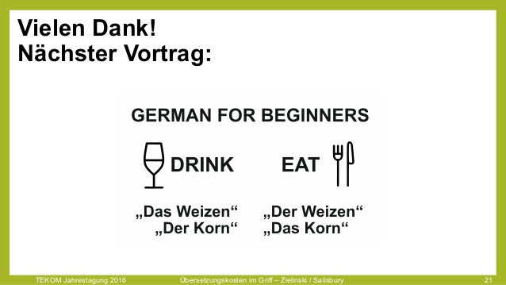
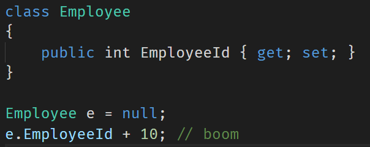
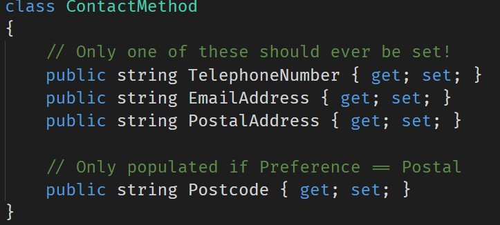
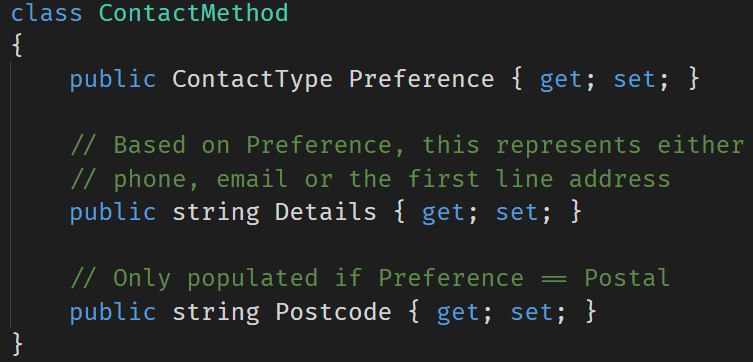
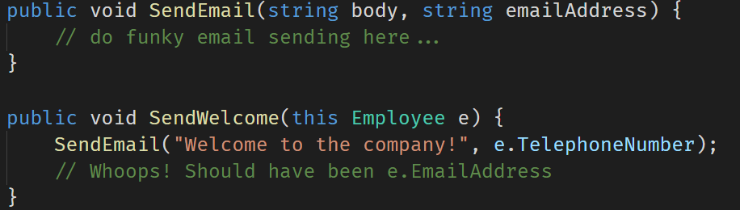
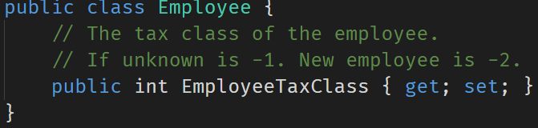

- title : Trusting your Domain with F#
- description : Talk for Kandddinsky
- author : Isaac Abraham
- theme : night
- transition : default

***

## Trusting your Domain
## with F#

***

## About me

* Isaac Abraham
* Microsoft MVP
* Founder of CIT
* "F# MVP and Azure dude"

**


---

## About you!

---

## What am I going to talk about?

* The importance of types for domain modelling?
* Parallels: *Spoken* and *Programming* languages
* Real-world case study
* Demo

***

## Why are static types important?

---

## **Communication**

* To yourself
* To other developers
* To non-developers!
* To the compiler!

---

## Be succinct

---

### Lightweight syntax
### Type Inference

---

## Expressing intent

---

### Coding Standard?
### Unit Tests?
### Comments?

---

## TYPES!

---

## Why Types?

* Types can't easily be ignored
* Types don't need to be maintained separately
* Types don't need unit tests

--- 

## Static Types
### Specify *rich* information about a domain
* Basic Types
* Generics
* Sum Types
* Nullability
* Units of Measure
* Dependent Types etc.

---

## Is F# a real possibility?


---

## It's too technical!


---

## Don't believe the myths

***

## Spoken languages

---

### "The Rabbit is Ready to Eat"

---


---


---

## Languages are full of ambiguities!

---

## Languages have different grammars

---

## Just like programming languages

| Less rules |  | More rules |
|:-|:-:|-:|
| Go   | C#     | Idris |
| English | German | Hungarian |

---

| Less power | | More powerful |
|:-|:-:|-:|
| Go   | C#     | Idris |
| English | German | Hungarian |

---

## Learning a new language can be hard

* English has little / no notion of gender
* Little notion of common cases e.g. accusative, dativ etc.
* Other languages take these cases for granted

---

## Example #2

---


---

## What can we infer from this?

---


---


---

## Take #1:
## English

---


| | Male | Female |
|-|:-:|:-:|
| Male | X | X |
| Female | X | X |

---


| | Singular | Plural |
|-|:-:|:-:|
| Singular | X | X |
| Plural | | |

---

## Summary

* English doesn't allow us to be *precise* about what we mean.
* **8 different combinations** from a *three word* sentence
* Just **2 conjungations** account for all 16 combinations

---

## Is this a good thing?

---

## Take #2:
## Deutsch

---

## Translate "I love you" to German!

---

## I love you


---


| | Male | Female |
|-|:-:|:-:|
| Male | X | X |
| Female | X | X |

---


| | Singular | Plural |
|-|:-:|:-:|
| Singular | X | |
| Plural | | |

---

## Summary

* German lets us encode *more information* than English
* No support for gender, but full control of plurality
* Only **4 possible ways** to interpret *ich liebe dich*
* **4 conjungations** account for all 16 combinations
* German also provides a third "dimension" for informal / formal
* German also has a third "neuter" gender

---

## How would you feel?

* No more die / das / den / dem
    * Only der!
* No more dich / dir / euch / Sie
    * Only du!

---

## German objects have different gender depending on the time!

---



---

## Take #3:
## Hebrew

---

## Translate "I love you" to Hebrew!

---

## I love you

## Ani ohev otach

---


| | Male | Female |
|-|:-:|:-:|
| Male | | X |
| Female | | |

---


| | Singular | Plural |
|-|:-:|:-:|
| Singular | X | |
| Plural | | |

---

## Object Gender

| | English | German | Hebrew |
|-|-|-|-|
| M > F | I love you | Ich liebe dich | Ani Ohev Otach 
| M > ***M*** | | | Ani Ohev ***Otcha***

---

## Subject Gender

| | English | German | Hebrew |
|-|-|-|-|
| M > F | I love you | Ich liebe dich | Ani Ohev Otach 
| ***F*** > F | | | Ani ***Ohevet*** Otach

---

## Object Plurality

| | English | German | Hebrew |
|-|-|-|-|
| M > F | I love you | Ich liebe dich | Ani Ohev Otach 
| M > MP | | Ich liebe ***euch*** | Ani Ohev ***Otchem***
| M > FP | | | Ani Ohev ***Etchen***

---

## Subject Plurality

| | English | German | Hebrew |
|-|-|-|-|
| M > F | I love you | Ich liebe dich | Ani Ohev Otach 
| MP > F | ***We*** love you | ***Wir lieben*** dich | ***Anachnu*** ***Ohavim*** Otach
| FP > F | | | ***Anachnu*** ***Ohevot*** Otach

---

## Summary

* Hebrew allows us to specify **exactly the case** we required
* Only **1 way** to say *I love you* for any given subject & object
* **Need to learn 10 different words**
* **16 conjungations** account for all 16 combinations
* In Hebrew you can omit the *subject* word entirely

---

## Is this a good thing?

***

## Considering Programming languages

---

### How can rich types help us?

---

## Guiding the compiler

A compiler makes use of type information to *help us*

**

* Trap errors early
* Make illegal states *unrepresentable*
* Provide guidance where errors may occur

---

### Type Inference

```fsharp
let x : int = 5
let y = 5 // infer y to be int
```
---

### Type Inference #2

```fsharp
let addFive number = 5 + number

// infer number to be an int.
// infer addFive to return an int.
```
---

### Type Inference #3

```fsharp
type Gender = Male | Female
type Language = English | German | Hebrew
type Plurality = Singular | Plural

let speak phrase =
    match phrase with
    | English, Male, Singular -> "I love you"
    | German, Male, Plural -> "ich liebe euch"
    | Hebrew, Female, Singular -> "ani ohev otach"

// phrase is a Tuple of (Language * Gender * Plurality)
```

---

## Compiler support

```fsharp
let speak phrase =
    match phrase with
    | Male, Singular -> "ich liebe dich"
    | Male, Plural -> "ich liebe euch"
    | Female, Singular -> "ich liebe dich"

// compiler warns that we have not handled the (Female + Plural) case!
```
---

## Sum Types

```fsharp
open System

type Weather =
| Sunny of temperature:int
| Wet of temperature:int * windSpeed:int
| Cold of temperature:int * snowFall:int

type Forecast =
    { ForecastDate : DateTime
      Prediction : Weather }

let forecast =
    { ForecastDate = DateTime(2017, 10, 17)
      Prediction = Sunny 10 }
```
---
## Sum Types continued...
```fsharp
let describe forecast =
    match forecast.Prediction with
    | Sunny _ -> "Sunny!"
    | Wet (_, windSpeed) when windSpeed > 10 -> "Wet and windy!"
    | Cold (_, 0) -> "It's cold!"
    | Cold _ -> "It's cold and snowing!!"
```
---
## Nullability

* Allows us to model the absence-of-a-value
* Rich support within F#
* In F#, values are *non-nullable by default*

**

```fsharp
open System

type OptionalForecast =
    { ForecastDate : DateTime
      Prediction : Weather option } // note the "option" marker

let forecasts =
    [ { ForecastDate = DateTime(2017, 10, 17); Prediction = Some(Sunny 5) }
      { ForecastDate = DateTime(2017, 10, 18); Prediction = None } ]

```
---
### F# *forces us* to handle missing values

**

```fsharp
open System

let tryDescribe weather =
    match weather with
    | None -> "Sorry, no forecast available!"
    | Some forecast -> describe forecast

```
---
## Units of Measure

**
```fsharp
[<Measure>] type celcius
[<Measure>] type cm
[<Measure>] type km
[<Measure>] type hour

type BetterWeather =
| Sunny of temperature:int<celcius>
| Wet of temperature:int<celcius> * windSpeed:int<km/hour>
| Cold of temperature:int<celcius> * snowFall:int<cm/hour>
```

***

## Common anti-patterns

---

### Implicitly null



---

```fsharp
type Employee = { EmployeeId : int }
let employee : Employee = null // will not compile!
```

---

### The Unrepresentable Value



---

### The Reusable Field



---

```fsharp
type ContactType =
    | Telephone of telephoneNumber:string
    | Email of emailAddress:string
    | Postal of firstLine:string * postCode:string

let act contactDetails =
    match contactDetails with
    | Telephone number -> sprintf "Calling %s..." number
    | Email address -> sprintf "Emailing %s..." address
    | Postal (firstLine, postCode) -> sprintf "Writing %s %s..." firstLine postCode
```

---

### The Mistyped Field



---

```fsharp
type EmailAddress = EmailAddress of string
type TelephoneNumber = TelephoneNumber of string

let sendEmail (body:string) (EmailAddress email) = () // send emails
let sendWelcome employee =
    sendEmail "Welcome to the company!" employee.TelephoneNumber
    // Won't compile - TelephoneNumber is not an EmailAddress

// Not a string, but a string "wrapped" in an EmailAddress
let email = EmailAddress "isaac@compositional-it.com"
```

---

### The Magic Number



---


---

## Types are there to help!

---

## More types <> not read-world

---

## More types <> too hard

***

## Case Study

---

## Pricing Sheet Engine

* Large German cargo airline
* Runs across ~100 markets
* Complex domain
    * Routing logic
    * Pricing models
    * Ubiquitous language?
* Lots of different data feeds
    * Multiple formats
    * "Nearly-compatible" data

---

## Naturally evolving model

### Started simple

* Records
* Primitive Types
* Scripts for exploration

---

### Slowly added more types

* Records
* Discriminated Unions
* Active Patterns
* Single Case wrappers
* Units of Measure

---

```fsharp
type RateLine =
    { Market : string
      ProductName : string
      Origin : string
      Destination : string
      Rate : float
      MarketShare : int
      ShippedLastYear : float }
```

---

```fsharp
type RateLine =
    { Market : Market
      ProductName : Product
      Origin : Airport
      Destination : Airport
      Rate : float<Euro/Kg>
      MarketShare : float<percentage>
      ShippedLastYear : float<kg> }
```

---

## End Result

* **No bugs** in the wild
* Calculations matched exactly to previous manual work
* Focus on solving business problems
* Able to walk through code with domain experts

***

## Demo

***

## Thank you!


https://compositional-it.com

[@isaac_abraham](http://twitter.com/isaac_abraham)

[isaac@compositional-it.com](mailto:isaac@compositional-it.com)
