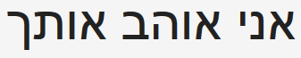

- title : Trusting your Domain with F#
- description : Talk for Kandddinsky
- author : Isaac Abraham
- theme : night
- transition : default

***

## Trusting your Domain
## with F#

***

## About me

* Isaac Abraham
* Microsoft MVP
* Founder of CIT
* "F# MVP and Azure dude"

**


---

## About you!

---

## What am I going to talk about?

* Using types when modelling domains
* ** *Spoken* languages** and **type systems**
* Real-world case study
* Demo

***

## Why are static types important?

---

## **Communcation**

* To yourself
* To other developers
* To non-technical people?
* To the compiler

***

## Spoken languages

---

### "The Rabbit is Ready to Eat"

---


---


---

## Languages are full of ambiguities!

---

## Languages have different grammars

---

## Just like programming languages

| Simpler |  | Complex |
|:-:|:-:|:-:|
| Go   | C#     | Idris |
| English | German | Hungarian |

---

| More "open" | | More "specific" |
|:-:|:-:|:-:|
| Go   | C#     | Idris |
| English | German | Hungarian |

---

## Learning a new language can be hard

* English has little / no notion of gender
* Virtually no notion of several cases
* Other languages take these cases for granted

---

## Example #2

---


---

## What can we infer from this?

---


---


---

## Take #1:
## English

---


| | Male | Female |
|-|:-:|:-:|
| Male | X | X |
| Female | X | X |

---


| | Singular | Plural |
|-|:-:|:-:|
| Singular | X | X |
| Plural | | |

---

## Summary

* English doesn't allow us to be *precise* about what we mean.
* **8 different combinations** from a *three word* sentence
* Just **2 conjungations** account for all 16 combinations

---

## Is this a good thing?

---

## Take #2:
## Deutsch

---

## Translate "I love you" to German!

---

## I love you


---


| | Male | Female |
|-|:-:|:-:|
| Male | X | X |
| Female | X | X |

---


| | Singular | Plural |
|-|:-:|:-:|
| Singular | X | |
| Plural | | |

---

## Summary

* German lets us encode *more information* than English
* No support for gender, but full control of plurality
* Only **4 possible ways** to interpret *ich liebe dich*
* **4 conjungations** account for all 16 combinations
* German also provides a third "dimension" for informal / formal

---

## Take #3:
## Hebrew

---

## Translate "I love you" to Hebrew!

---

## I love you

## Ani ohev otach

---


| | Male | Female |
|-|:-:|:-:|
| Male | | X |
| Female | | |

---


| | Singular | Plural |
|-|:-:|:-:|
| Singular | X | |
| Plural | | |
---

## Gender

| Subject | Object | |
|-|-|-|
| Male | Female | Ani Ohev Otach |
| Male | ***Male*** | Ani Ohev Ot***cha*** |
| ***Female*** | Male | Ani Ohev***et*** Otach |

---

## Object Plurality

*I love you / ich liebe euch*

| Subject | Object | |
|-|-|-|
| Male | Female | Ani Ohev Otach |
| Male | ***General Plural*** | Ani Ohev ***Otchem*** |
| Male | ***Female-only Plural*** | Ani Ohev ***Etchen*** |

---

## Subject Plurality

*We love you / wir lieben dich*


| Subject | Object | |
|-|-|-|
| Male | Female | Ani Ohev Otach |
| ***Male, Plural*** | Female | ***Anachnu*** Oh***a***v***im*** Otach | 
| ***Female, Plural*** | Female | ***Anachnu*** Ohev***ot*** Otach |

---

## Summary

* Hebrew allows us to specify **exactly the case** we required
* Only **1 way** to interpret *ani ohev otach*
* **10 different words for all conjungations**
* **16 conjungations** account for all 16 combinations
* In Hebrew you can omit the *subject* word entirely

---

## Is this a good thing?

***

## Considering Programming languages

---

## Communication
* Be succinct
    * Lightweight syntax
    * Type Inference
* Express the intent in detail
    * Types!

---

## Static Types

* Specify *rich* information about a domain
* Generics
* Sum Types
* Nullability
* Units of Measure
* Dependent Types etc.

---

## Guiding the compiler

* A compiler that makes use this this information to guide us
* Trap errors early
* Make illegal states *unrepresentable*
* Provide guidance where errors may occur

---

### Type Inference

```fsharp
let x : int = 5
let y = 5 // infer y to be int
```
---

### Type Inference #2

```fsharp
let addFive number = 5 + number

// infer number to be an int.
// infer addFive to return an int.
```
---

### Type Inference #3

```fsharp
type Gender = Male | Female
type Language = English | German | Hebrew
type Plurality = Singular | Plural

let speak phrase =
    match phrase with
    | English, Male, Singular -> "I love you"
    | German, Male, Plural -> "ich liebe euch"
    | Hebrew, Female, Singular -> "ani ohev otach"

// phrase is a Tuple of (Language * Gender * Plurality)
```

---

## Compiler support

```fsharp
let speak phrase =
    match phrase with
    | Male, Singular -> "ich liebe dich"
    | Male, Plural -> "ich liebe euch"
    | Female, Singular -> "ich liebe dich"

// compiler warns that we have not handled the (Female + Plural) case!
```
---

## Sum Types

```fsharp
open System

type Weather =
| Sunny of temperature:int
| Wet of temperature:int * windSpeed:int
| Cold of temperature:int * snowFall:int

type Forecast =
    { ForecastDate : DateTime
      Prediction : Weather }

let forecast =
    { ForecastDate = DateTime(2017, 10, 17)
      Prediction = Sunny 10 }
```

---

## Sum Types continued...
```fsharp
let describe forecast =
    match forecast.Prediction with
    | Sunny _ -> "Sunny!"
    | Wet (_, windSpeed) when windSpeed > 10 -> "Wet and windy!"
    | Cold (_, 0) -> "It's cold!"
    | Cold _ -> "It's cold and snowing!!"
```

---

## Nullability

* Allows us to model the absence-of-a-value
* Rich support within F#
* In F#, values are *non-nullable by default*

**

```fsharp
open System

type OptionalForecast =
    { ForecastDate : DateTime
      Prediction : Weather option } // note the "option" marker

let forecasts =
    [ { ForecastDate = DateTime(2017, 10, 17); Prediction = Some(Sunny 5) }
      { ForecastDate = DateTime(2017, 10, 18); Prediction = None } ]

```
---

### F# *forces us* to handle missing values

**

```fsharp
open System

let tryDescribe weather =
    match weather with
    | None -> "Sorry, no forecast available!"
    | Some forecast -> describe forecast

```

---

## Units of Measure

**
```fsharp
[<Measure>] type celcius
[<Measure>] type cm
[<Measure>] type km
[<Measure>] type hour

type BetterWeather =
| Sunny of temperature:int<celcius>
| Wet of temperature:int<celcius> * windSpeed:int<km/hour>
| Cold of temperature:int<celcius> * snowFall:int<cm/hour>
```
***

## Common Anti-patterns

---

### Implicitly null

```csharp
class Employee
{
    public int EmployeeId { get; set; }
}

Employee e = null;
e.EmployeeId + 10; // boom
```
---

### Sometimes null, sometimes mandatory

```csharp
class ContactMethod
{
    public ContactType Preference { get; set; }

    // Only one of these should ever be set!
    // First check Preference value.
    public string TelephoneNumber { get; set; }
    public string EmailAddress { get; set; }
    public string PostalAddress { get; set; }

    // Only populated if Preference == Postal
    public string Postcode { get; set; }
}
```
---

### The Reusable Field

```csharp
class ContactMethodResuable
{
    public ContactType Preference { get; set; }

    // Based on Preference, this represents either
    // phone, email or the first line address
    public string Details { get; set; }
    
    // Only populated if Preference == Postal
    public string Postcode { get; set; }
}
```
---

```fsharp
type ContactType =
    | Telephone of telephoneNumber:string
    | Email of emailAddress:string
    | Postal of firstLine:string * postCode:string

let act contactDetails =
    match contactDetails with
    | Telephone number -> sprintf "Calling %s..." number
    | Email address -> sprintf "Emailing %s..." address
    | Postal (firstLine, postCode) -> sprintf "Writing %s %s..." firstLine postCode
```
---

### The mistyped field

```csharp
public void SendEmail(string body, string emailAddress) {
    // do funky email sending here...
}

public void SendWelcome(this Employee e) {
    SendEmail("Welcome to the company!", e.TelephoneNumber);
    // Whoops! Should have been e.EmailAddress
}
```

---
```fsharp
type EmailAddress = EmailAddress of string
type TelephoneNumber = TelephoneNumber of string

let sendEmail (body:string) (EmailAddress email) = () // send emails
let sendWelcome employee =
    sendEmail "Welcome to the company!" employee.TelephoneNumber
    // Won't compile - TelephoneNumber is not an EmailAddress

// Not a string, but a string "wrapped" in an EmailAddress
let email = EmailAddress "isaac@compositional-it.com"
```

***

## Case Study

---

* Routing and Pricing Engine for a large German airline

***

## Demo

***

## Thank you!


https://compositional-it.com
