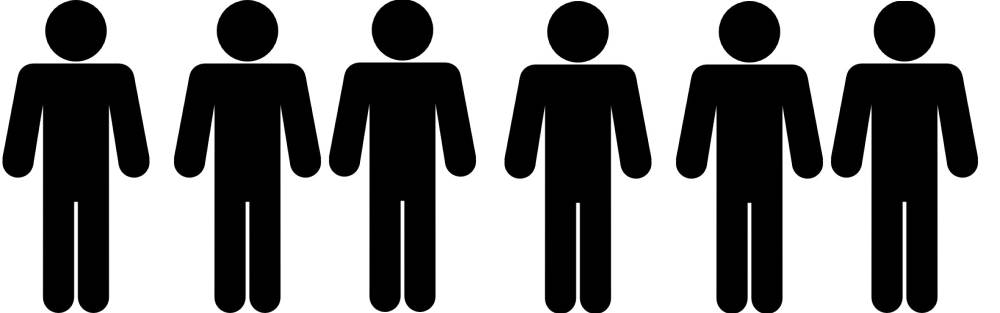
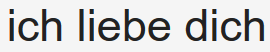

- title : Incremental Modelling with F#
- description : Talk for Kandddinsky
- author : Isaac Abraham
- theme : night
- transition : default

***

## Incremental Modelling
## with F#

***

## About me

* Isaac Abraham
* Microsoft MVP
* Founder of CIT
* "F# MVP and Azure dude"

**


---

## About you!

---

## What am I going to talk about?

* Using types when modelling domains
* ** *Spoken* languages** and **type systems**
* Real-world case study
* Demo

***

## Why are Type Systems important?

***

## Spoken languages

---

### "The Rabbit is Ready to Eat"

---


---


---

## Languages are full of ambiguities!

---

## Languages have different grammars

---

## Just like programming languages

| Simpler |  | Complex |
|:-:|:-:|:-:|
| Go   | C#     | Idris |
| English | German | Hungarian |

---

| More "open" | | More "specific" |
|:-:|:-:|:-:|
| Go   | C#     | Idris |
| English | German | Hungarian |

---

## Learning a new language can be hard

* English has little / no notion of gender
* Virtually no notion of several cases
* Other languages take these cases for granted

---

## Example #2

---


---

## What can we infer from this?

---


---



---

## Take #1:
## English

---


| | Male | Female |
|-|:-:|:-:|
| Male | X | X |
| Female | X | X |

---


| | Singular | Plural |
|-|:-:|:-:|
| Singular | X | X |
| Plural | | |

---

## Summary

* English doesn't allow us to be *precise* about what we mean.
* **8 different combinations** from a *three word* sentence
* Just **2 conjungations** account for all 16 combinations

---

## Is this a good thing?

---

## Take #2:
## Deutsch

---

## Translate "I love you" to German!

---

## I love you


---


| | Male | Female |
|-|:-:|:-:|
| Male | X | X |
| Female | X | X |

---


| | Singular | Plural |
|-|:-:|:-:|
| Singular | X | |
| Plural | | |

---

## Summary

* German lets us encode *more information* than English
* No support for gender, but full control of plurality
* Only **4 possible ways** to interpret *ich liebe dich*
* **4 conjungations** account for all 16 combinations
* German also provides a third "dimension" for informal / formal

---

## Take #3:
## Hebrew

---

## Translate "I love you" to Hebrew!

---

## I love you

## Ani ohev otach

---


| | Male | Female |
|-|:-:|:-:|
| Male | | X |
| Female | | |

---


| | Singular | Plural |
|-|:-:|:-:|
| Singular | X | |
| Plural | | |
---

## Gender

| Subject | Object | |
|-|-|-|
| Male | Female | Ani Ohev Otach |
| Male | ***Male*** | Ani Ohev Ot***cha*** |
| ***Female*** | Male | Ani Ohev***et*** Otach |

---

## Object Plurality

*I love you / ich liebe euch*

| Subject | Object | |
|-|-|-|
| Male | Female | Ani Ohev Otach |
| Male | ***General Plural*** | Ani Ohev ***Otchem*** |
| Male | ***Female-only Plural*** | Ani Ohev ***Etchen*** |

---

## Subject Plurality

*We love you / wir lieben dich*


| Subject | Object | |
|-|-|-|
| Male | Female | Ani Ohev Otach |
| ***Male, Plural*** | Female | ***Anachnu*** Oh***a***v***im*** Otach | 
| ***Female, Plural*** | Female | ***Anachnu*** Ohev***ot*** Otach |

---

## Summary

* Hebrew allows us to specify **exactly the case** we required
* Only **1 way** to interpret *ani ohev otach*
* **10 different words for all conjungations**
* **16 conjungations** account for all 16 combinations
* In Hebrew you can omit the *subject* word entirely

---

## Is this a good thing?

---

## Considering Programming languages

---

## Conciseness
* *Not* "making things hard to read" :(
* *Is* "removing things that don't add value" :)
* Type Inference
* Lightweight syntax

---

## Explicit Types

* Specify *rich* information about a domain
* Generics
* Sum Types
* Nullability
* Units of Measure
* Dependent Types etc.

---

## A smart compiler

* A compiler that makes use this this information to guide us
* Trap errors early
* Make illegal states *unrepresentable*
* Provide guidance where errors may occur

---

### Type Inference

```fsharp
let x : int = 5
let y = 5 // infer x to be int
```
---

### Type Inference #2

```fsharp
let addFive x = 5 + x

// infer x to be an int.
// infer addFive to return an int.
```
---

### Type Inference #3

```fsharp
type Temperature = Hot | Warm | Cold | Freezing

let checkWeather weather =
    match weather with
    | "London", Hot -> "It's hot in London!"
    | "Berlin", Cold -> "What a surprise. It's cold in Germany!"
    | _, Warm -> "It's warm"
    | _ -> "Something else..."

// weather is inferred as a Tuple of (string * Temperature)
```
---

## Common Anti-patterns


***

## Case Study

***

## Demo

***

## Thank you!


https://compositional-it.com
